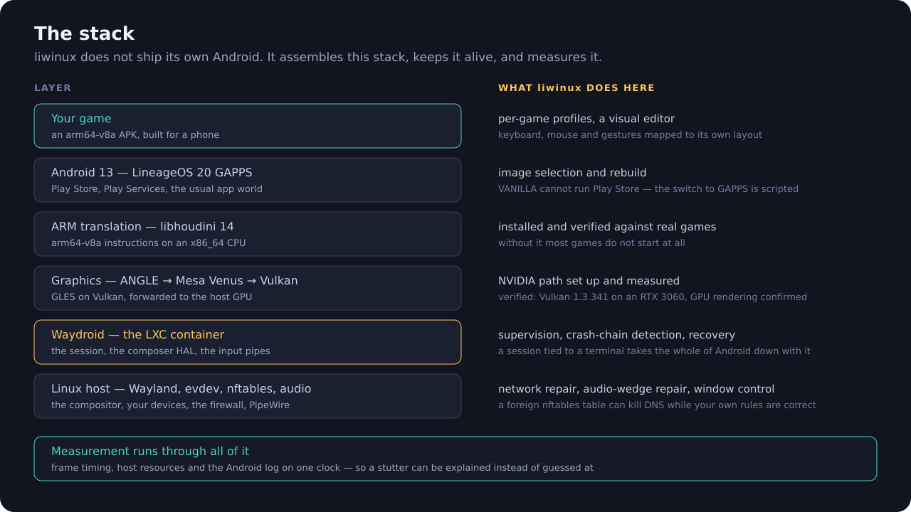

<p align="center">
  
</p>

<p align="center">
  <a href="#status"></a>
  
  
  
</p>

---

**liwinux** is an Android gaming layer for Linux. It is what GameLoop or
BlueStacks are on Windows: you install it, your games run, your keyboard and
mouse work, and the thing stays up.

Getting there takes more than a key mapper. A phone game is arm64 code
expecting a GPU, a Play Store account, a network and a touchscreen — on a
desktop, every one of those has to be arranged. liwinux arranges them, keeps
them alive when they break, and **measures** whether any of it actually helped.

```bash
liw session start            # bring Android up, detached from your terminal
liw keymap start --grab      # map keyboard and mouse into the game
liw bench com.some.game      # frame timing and host resource use
liw trace com.some.game      # find out WHY it stutters
```

---

## The stack

<p align="center">
  
</p>

liwinux does not ship its own Android, and it does not pretend to have written
[Waydroid](https://waydro.id/), libhoudini or Mesa. What it does is make that
stack into something you can actually play on:

| Layer | What was needed | What liwinux does |
|---|---|---|
| **GPU** | mobile games expect a GPU; a container does not have one | sets up and verifies the NVIDIA path — ANGLE (GLES→Vulkan) over Mesa Venus. Measured on this machine: **Vulkan 1.3.341, RTX 3060, GPU rendering confirmed**, not software fallback |
| **CPU** | games ship arm64-v8a; the host is x86_64 | installs and verifies **libhoudini 14**, then proves it with a real arm64 game rather than a synthetic check |
| **Android image** | Play Store does not work on the VANILLA image | scripted rebuild to **LineageOS 20 GAPPS**, with the microG/signature-spoofing traps documented |
| **Network** | the container silently loses DNS | diagnoses and repairs it — including the case where a *foreign* nftables table hijacks DNS while your own firewall rules are perfectly correct |
| **Audio** | a wedged audio HAL freezes every app at its loading screen | detects the wedge from the log and restarts the HAL, instead of restarting all of Android |
| **Session** | `waydroid session start` runs in the foreground and takes Android down with it | owns the session detached from any terminal, watches six health signals, recovers |
| **Input** | there is no keyboard or mouse in a phone game | a mapping engine with joystick, taps, gestures and **unbounded FPS aim** |
| **Measurement** | "it feels laggy" is not actionable | frame timing, host resources and the Android log on one clock |

Each of those rows is a bug that cost real hours. The network one looked like
"Play Store has no internet". The audio one looked like "the game will not
open". Neither symptom resembles its cause, which is why the diagnosis is in
the tool and not in a wiki page.

---

## What liwinux itself is

### An emulator that supervises rather than reimplements

`waydroid session start` runs in the foreground. When it dies the composer HAL
goes with it, then `system_server`, then every app — and Android does not fully
recover: the default route never comes back, leaving a network-less zombie whose
symptom looks nothing like the cause.

`liwd` owns the session instead, detached from any terminal, and watches six
separate health signals rather than one boolean:

```
$ liw session health
  ✓ session running
  ✓ container running
  ✓ composer HAL alive
  ✓ composer connection fresh
  ✓ Android boot completed
  ✓ IP assigned
```

The fourth exists because a composer that restarted *after* the session leaves a
stale binder connection: everything looks alive, but no window appears and
`waydroid app launch` returns `Sending reply failed`.

### A mouse that does not fight you

This is the part with no equivalent elsewhere.

Keyboard mappers for Android inject at the framework level
(`InputManager.injectInputEvent`, usually through an `app_process` service). By
then the coordinates have been fitted into screen space, so the mouse cannot
travel past the edge of the display. Every such project then has to lift the
finger and put it back at the centre, and anyone who has used one knows how that
feels: the aim stutters, sometimes it stops registering for a second, sometimes
it drifts.

<p align="center">
  
</p>

Waydroid's patched `EventHub` reads touches from a FIFO inside the container.
Nothing on that path clamps — there is no kernel evdev layer,
`TouchInputMapper` does not clamp, and `InputDispatcher` does not re-pick a
window on MOVE. So a finger that goes down inside the game keeps reaching it
even when it wanders off-screen, and the whole recentring problem simply does
not arise.

The reasoning, the source references and the verification procedure are in
[`docs/mouse-aim.md`](docs/mouse-aim.md). The engine itself lives in
**[liwinux-keymapper](https://github.com/Liwinux-Project/liwinux-keymapper)**.

Profiles are per-game TOML in normalized coordinates, so they survive a
resolution change:

```toml
[bindings.move]
type = "joystick"
up = { Key = 17 }                # W
center = { x = 0.148, y = 0.738 }
radius = 0.085

[bindings.look]
type = "aim"
origin = { x = 0.5004, y = 0.50 }
sensitivity = 0.0006
unbounded = true
```

And you place them by dragging markers over a screenshot of the game:

```bash
liw profile edit com.some.game
```

### Numbers instead of adjectives

`liw bench` samples `SurfaceFlinger --latency` and correlates it with host GPU,
CPU, VRAM and memory pressure. A real run, on Special Forces Group 2:

```
FRAMES 5016 intervals, 5018 unique frames, coverage 91%
       the game is locked to 60 FPS (display 180 Hz)
  p50 16.67 ms (60 FPS)   p99 22.34 ms   worst 33.31 ms   jank>1.5x 0.22%

HOST   GPU  mean 53.6%  peak 82.0%     CPU  mean 37.3%  peak 54.8%
```

Jank is measured against the **game's** frame period, not the display refresh.
An earlier version compared against the 180 Hz refresh and reported 99.8% jank
for a game that was drawing perfectly steadily at 60 — the metric was wrong, not
the game.

`liw trace` goes further and answers *why*. It puts frame timing, the Android
log and host samples on one clock (`CLOCK_MONOTONIC`) and reports what was
happening during each stall:

```
VERDICT
  ▸ ad mediation stack — in 2/11 stutters
    The SDK tries several ad networks in turn and decodes the video ad in
    software — Waydroid has no hardware video decoder.
```

That verdict is real. An "8-second freeze" that looked like a system fault
turned out to be the game's own ad SDK.

`liw perf status` reports the tuning levers it can see — CPU governor, EPP,
NVIDIA PowerMizer, frame budget, container CPU weight — and refuses to claim any
of them helps until it has been measured.

---

## Architecture

<p align="center">
  
</p>

Three processes, split by privilege:

| | Runs as | Does |
|---|---|---|
| `liw` | you | the command line; talks to `liwd`, or straight to Waydroid if the daemon is absent |
| `liwd` | your user | session supervision, the keymapper, window control |
| `liwd-helper` | root | the few operations that genuinely need it |

**`liwd-helper` deliberately exposes no `Shell()` method.** A general-purpose
shell interface would hand every local user a path to root execution, even
behind polkit. Instead it offers narrow named operations — `GetProp`,
`ForegroundPackage`, `SurfaceLatency`, `Logcat`, `NetRepair`, `RestartAudio`,
`OpenTouchPipe` — each bound to its own polkit action with its inputs validated.

`OpenTouchPipe` returns a file descriptor rather than proxying writes, so
authorization is asked once and the 200 Hz write traffic never crosses IPC.

---

## Install

Needs a working Waydroid session, a Wayland compositor (developed on KWin), and
Rust.

```bash
git clone https://github.com/Liwinux-Project/liwinux
cd liwinux
cargo build --release

install -Dm755 target/release/liw   ~/.local/bin/liw
install -Dm755 target/release/liwd  ~/.local/bin/liwd
install -Dm644 dist/systemd/liwd.service ~/.config/systemd/user/liwd.service
install -Dm644 -t ~/.local/share/liwinux/kwin scripts/kwin/*.js
systemctl --user enable --now liwd

sudo bash dist/install-helper.sh    # the root service, its polkit policy and D-Bus config
```

Then calibrate your keyboard and mouse — do not guess, measure:

```bash
liw keymap detect --save           # press a key
liw keymap detect --mouse --save   # move the mouse
liw keymap detect --hotkey --save  # pick the game-mode key
```

Calibration writes a stable `/dev/input/by-id/...` path. `eventN` numbers are
not stable across reboots; on this machine `event23` was the keyboard one day
and an HDMI audio device the next, and the keymapper silently stopped working.

The stack setup itself is scripted, with what each step verifies written next
to it: `scripts/poc/poc0-verify.sh` (GPU rendering), `poc1-arm.sh` (houdini),
`scripts/rebuild-gapps.sh` (the GAPPS image) and `scripts/liw-net-doctor.sh`
(the network).

---

## Status

Early. It runs two real games well and every number above came off this machine,
but it has been developed against **one** setup: CachyOS, KWin on Wayland, an
RTX 3060 with `waydroid-nvidia`, an Intel i5-12400F.

Known to work:

- the full stack: GPU acceleration, ARM translation, Play Store, networking
- session supervision, crash-chain detection, automatic recovery
- network repair, including foreign-firewall diagnosis
- audio-wedge detection and repair
- keyboard and mouse mapping with sub-millisecond engine latency (p99 0.17 ms
  for our own layer — that measurement covers our layer only, and says so)
- unbounded FPS aim through the touch pipe
- frame timing, stall correlation, lever diagnosis

Not done:

- the performance levers are diagnosed but not yet applied or measured
- window-mode coordinate mapping is plumbed but untested; fullscreen is assumed
- tested on KWin only; other compositors need their own focus and geometry scripts
- AMD and Intel GPU paths are untouched — only the NVIDIA path was built and measured
- no packaging yet

---

## Repository layout

```
crates/liw           the command line
crates/liwd          the user service
crates/liwd-helper   the root service
crates/liw-core      Waydroid, session health, bench, trace, perf
crates/liw-input     the mapping engine  (mirrored to liwinux-keymapper)
docs/mouse-aim.md    why the aim problem exists and how it was removed
profiles/            example game profiles
dist/                systemd units, polkit policy, D-Bus config
scripts/poc/         stack setup and verification: GPU, houdini, GAPPS, DNS
scripts/kwin/        compositor scripts
```

Tests are behavioural, not incidental: 233 of them, and most encode a bug that
actually happened. `overlapping_snapshots_do_not_inflate_sample_count` exists
because a measurement once reported 23560 intervals from 7997 frames.

---

## Credits

liwinux stands on work it did not write, and the setup it automates is largely
the community's:

- [Waydroid](https://waydro.id/) — the container and the Android integration
- [waydroid-nvidia](https://github.com/rekulous/waydroid-nvidia) — the NVIDIA/Venus path
- [waydroid_script](https://github.com/casualsnek/waydroid_script) — houdini and GAPPS installation
- [XtMapper](https://github.com/Xtr126/XtMapper) (GPL-3) — the non-linear aim scaling and
  delayed-reset idea, on which the earlier bounded implementation was built

## License

GPL-3.0-or-later.

## Desktop front end

`liw-ui` is a gpui application: one Rust binary, no web runtime. It is a
**viewport onto `liwd`** — every fact it draws is a daemon property with a
change signal, so it redraws when something happens rather than on a timer.

It is also disposable. All state lives in the daemon, so closing the window
changes nothing about a running session.

**It never sits on top of the game.** KWin can hand a fullscreen window
straight to the display; an always-on-top overlay closes that path and forces
full composition, which costs frames exactly where they matter. A GameLoop
style sidebar over the game is the one thing this deliberately does not do.

## Control plane

`liwd` owns the session and exposes it on the session bus as
`id.liwinux.Manager1`, so a UI does not have to drive the CLI:

* **Properties**, all announcing changes: `State`, `HealthJson`,
  `KeymapperRunning`, `GameMode`, `Grabbed`, `HostFocused`,
  `ActiveProfile`, `ForegroundPackage`. `HealthJson` is served from the
  supervision loop's cache — `Health()` still measures on demand, and it
  is expensive enough that nothing should poll it.
* **Signal** `KeymapperEvent(kind, detail)` for things that are not
  state: a system overlay covering the game, an escape request, a
  profile file changing on disk.
* **Profiles**: `ListProfiles`, `GetProfile`, `SaveProfile`,
  `DeleteProfile`. Writes preserve the file's comments, and editing a
  system profile creates a user file that shadows it rather than
  changing it in place.
* **Errors carry names** — `id.liwinux.Error.NoSession`, `.NoHelper`,
  `.NoProfile`, `.NoWindow`, `.Invalid`, `.Failed` — so a client can
  branch instead of matching on prose.

