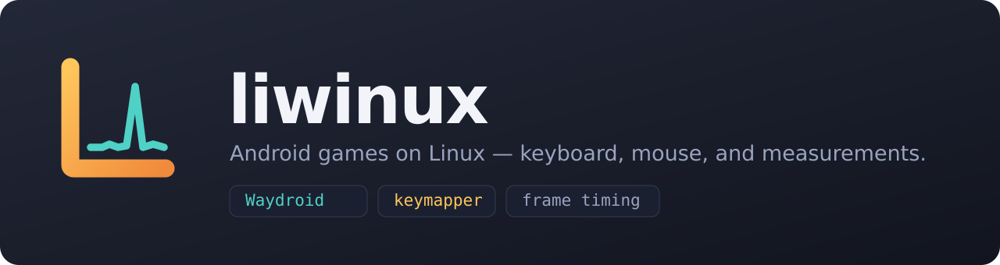
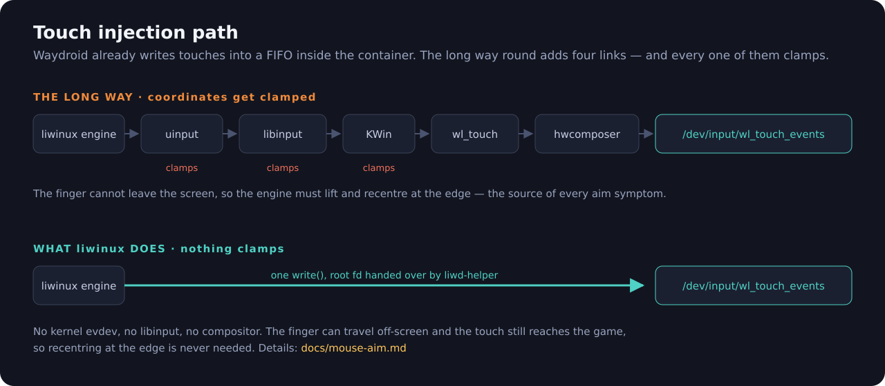
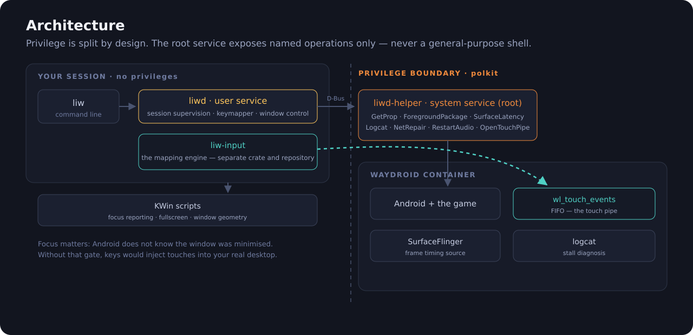

<p align="center">
  
</p>

<p align="center">
  <a href="#status"></a>
  
  
  
</p>

---

**liwinux** runs Android games on Linux with a keyboard and mouse, on top of
[Waydroid](https://waydro.id/). It is what GameLoop or BlueStacks are on
Windows — except it does not ship its own Android. It supervises the one you
already have, maps your input into it, and **measures** whether any of it
actually helped.

That last part is the point. Every claim in this repository was measured before
it was written down, and the tools that did the measuring ship with it.

```bash
liw session start            # bring Android up, detached from your terminal
liw keymap start --grab      # map keyboard and mouse into the game
liw bench com.some.game      # frame timing and host resource use
liw trace com.some.game      # find out WHY it stutters
```

---

## Why another one of these

Most keyboard-mapping tools for Android inject at the framework level
(`InputManager.injectInputEvent`, usually through an `app_process` service).
That works, but the coordinates have already been fitted into screen space by
the time they arrive, so the mouse cannot travel past the edge of the display.
Every one of those projects then has to lift the finger and put it back at the
centre, and everyone who has used one knows how that feels: the aim stutters,
sometimes it stops registering for a second, sometimes it drifts.

Waydroid turns out to have a way around this.

<p align="center">
  
</p>

Waydroid's patched `EventHub` reads touches from a FIFO inside the container.
Nothing on that path clamps — there is no kernel evdev layer, `TouchInputMapper`
does not clamp, and `InputDispatcher` does not re-pick a window on MOVE. So a
finger that goes down inside the game keeps reaching it even when it wanders
off-screen, and the whole recentring problem simply does not arise.

The reasoning, the source references and the verification procedure are in
[`docs/mouse-aim.md`](docs/mouse-aim.md).

---

## What it does

### Session supervision

`waydroid session start` runs in the foreground. When it dies the composer HAL
goes with it, then `system_server`, then every app — and Android does not fully
recover: the default route never comes back, leaving a network-less zombie whose
symptom ("Play Store has no internet") looks nothing like the cause.

`liwd` owns the session instead, detached from any terminal, and watches six
separate health signals rather than one boolean:

```
$ liw session health
  ✓ session running
  ✓ container running
  ✓ composer HAL alive
  ✓ composer connection fresh
  ✓ Android boot completed
  ✓ IP assigned
```

The fourth one exists because a composer that restarted *after* the session
leaves a stale binder connection: everything looks alive, but no window appears
and `waydroid app launch` returns `Sending reply failed`.

### Keyboard and mouse mapping

Profiles are per-game TOML, in normalized coordinates so they survive a
resolution change. Bindings can be taps, toggles, a WASD joystick, swipe
gestures with easing curves, and FPS aim.

```toml
[bindings.move]
type = "joystick"
up = { Key = 17 }                # W
center = { x = 0.148, y = 0.738 }
radius = 0.085

[bindings.look]
type = "aim"
origin = { x = 0.5004, y = 0.50 }
sensitivity = 0.0006
unbounded = true
```

There is a visual editor — take a screenshot of the game, drag the markers onto
the buttons:

```bash
liw profile edit com.some.game
```

The engine lives in its own repository:
**[liwinux-keymapper](https://github.com/Liwinux-Project/liwinux-keymapper)**.

### Measurement

`liw bench` samples `SurfaceFlinger --latency` and correlates it with host GPU,
CPU, VRAM and memory pressure. A real run, on Special Forces Group 2:

```
FRAMES 5016 intervals, 5018 unique frames, coverage 91%
       the game is locked to 60 FPS (display 180 Hz)
  p50 16.67 ms (60 FPS)   p99 22.34 ms   worst 33.31 ms   jank>1.5x 0.22%

HOST   GPU  mean 53.6%  peak 82.0%     CPU  mean 37.3%  peak 54.8%
```

Jank is measured against the **game's** frame period, not the display refresh.
That distinction matters: an earlier version compared against the 180 Hz refresh
and reported 99.8% jank for a game that was drawing perfectly steadily at 60.

`liw trace` goes further and answers *why*. It puts frame timing, the Android
log and host samples on one clock (`CLOCK_MONOTONIC`) and reports what was
happening during each stall:

```
VERDICT
  ▸ ad mediation stack — in 2/11 stutters
    The SDK tries several ad networks in turn and decodes the video ad in
    software — Waydroid has no hardware video decoder.
```

That verdict is real. An "8-second freeze" that looked like a system fault
turned out to be the game's own ad SDK.

---

## Architecture

<p align="center">
  
</p>

Three processes, split by privilege:

| | Runs as | Does |
|---|---|---|
| `liw` | you | the command line; talks to `liwd`, or straight to Waydroid if the daemon is absent |
| `liwd` | your user | session supervision, the keymapper, window control |
| `liwd-helper` | root | the few operations that genuinely need it |

**`liwd-helper` deliberately exposes no `Shell()` method.** A general-purpose
shell interface would hand every local user a path to root execution, even
behind polkit. Instead it offers narrow named operations — `GetProp`,
`ForegroundPackage`, `SurfaceLatency`, `Logcat`, `NetRepair`, `RestartAudio`,
`OpenTouchPipe` — each bound to its own polkit action with its inputs validated.

`OpenTouchPipe` returns a file descriptor rather than proxying writes, so
authorization is asked once and the 200 Hz write traffic never crosses IPC.

---

## Install

Needs a working Waydroid session, a Wayland compositor (developed on KWin), and
Rust.

```bash
git clone https://github.com/Liwinux-Project/liwinux
cd liwinux
cargo build --release

install -Dm755 target/release/liw   ~/.local/bin/liw
install -Dm755 target/release/liwd  ~/.local/bin/liwd
install -Dm644 dist/systemd/liwd.service ~/.config/systemd/user/liwd.service
install -Dm644 -t ~/.local/share/liwinux/kwin scripts/kwin/*.js
systemctl --user enable --now liwd

sudo bash dist/install-helper.sh    # the root service, its polkit policy and D-Bus config
```

Then calibrate your keyboard and mouse — do not guess, measure:

```bash
liw keymap detect --save           # press a key
liw keymap detect --mouse --save   # move the mouse
liw keymap detect --hotkey --save  # pick the game-mode key
```

Calibration writes a stable `/dev/input/by-id/...` path. `eventN` numbers are
not stable across reboots; on this machine `event23` was the keyboard one day
and an HDMI audio device the next, and the keymapper silently stopped working.

---

## Status

Early. It runs two real games well and every number above came off this machine,
but it has been developed against **one** setup: CachyOS, KWin on Wayland, an
RTX 3060 with `waydroid-nvidia`, an Intel i5-12400F.

Known to work:

- session supervision, crash-chain detection, automatic recovery
- container networking repair (including the case where a third-party nftables
  table hijacks DNS while your own firewall rules are perfectly correct)
- keyboard and mouse mapping with sub-millisecond engine latency (p99 0.17 ms
  for our own layer — that measurement covers our layer only, and says so)
- unbounded FPS aim through the touch pipe
- frame timing, stall correlation, lever diagnosis

Not done:

- the performance levers are diagnosed but not yet applied or measured
  (`liw perf status` reports them and refuses to promise anything unmeasured)
- window-mode coordinate mapping is plumbed but untested; fullscreen is assumed
- tested on KWin only; other compositors need their own focus and geometry scripts
- no packaging yet

---

## Repository layout

```
crates/liw           the command line
crates/liwd          the user service
crates/liwd-helper   the root service
crates/liw-core      Waydroid, session health, bench, trace, perf
crates/liw-input     the mapping engine  (mirrored to liwinux-keymapper)
docs/mouse-aim.md    why the aim problem exists and how it was removed
profiles/            example game profiles
dist/                systemd units, polkit policy, D-Bus config
scripts/kwin/        compositor scripts
```

Tests are behavioural, not incidental: 233 of them, and most encode a bug that
actually happened. `overlapping_snapshots_do_not_inflate_sample_count` exists
because a measurement once reported 23560 intervals from 7997 frames.

---

## License

GPL-3.0-or-later. The non-linear aim scaling and delayed-reset idea came from
[XtMapper](https://github.com/Xtr126/XtMapper) (GPL-3), and the earlier bounded
implementation was built on them.
